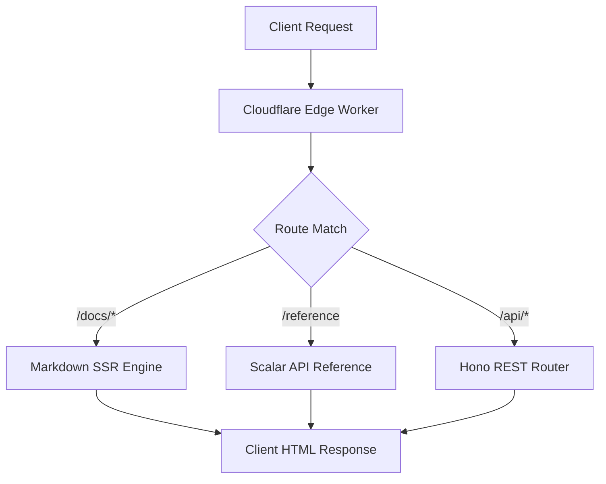
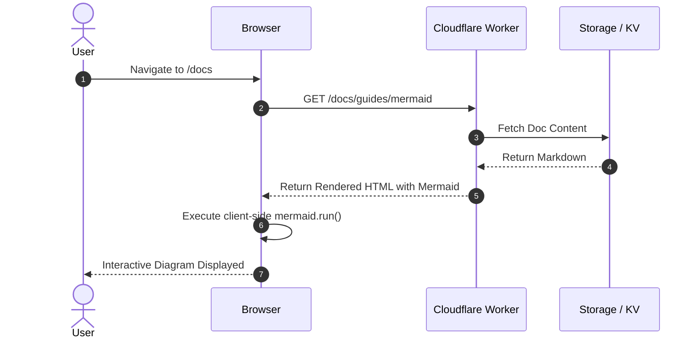

# Authoring Markdown Docs

Documentation files are organized inside the `content/docs/` directory. Each markdown file can include YAML frontmatter, headers, tables, callouts, and highlighted code snippets.

## Frontmatter Schema

Each document supports the following YAML frontmatter keys:

| Field | Type | Required | Description |
| :--- | :--- | :--- | :--- |
| `title` | `string` | **Yes** | The document's title in the sidebar, header, and search index |
| `description` | `string` | No | Short description for SEO and search snippets |
| `category` | `string` | No | Overrides the folder name for category grouping |
| `order` | `number` | No | Sort order within the category |
| `slug` | `string` | No | Custom route slug (e.g. `/docs/custom-slug`) |
| `tags` | `string[]` | No | Array of tags for categorization |

### Example Frontmatter

```yaml
---
title: Authentication & Tokens
description: Learn how API keys and JWT authentication work.
category: Security & Auth
order: 1
tags: ["auth", "security", "tokens"]
---
```

## Supported GitHub Alerts & Callouts

Add visual emphasis with alert callouts:

> [!NOTE]
> Informational context or helpful explanations.

> [!TIP]
> Best practices, performance optimizations, and handy shortcuts.

> [!IMPORTANT]
> Must-know details or crucial requirements.

> [!WARNING]
> Breaking changes or things that require caution.

> [!CAUTION]
> Dangerous operations that could result in data loss.

## Tables & Formatting

Standard GitHub Flavored Markdown (GFM) tables are automatically wrapped in responsive containers:

| HTTP Status | Meaning | Typical Usage |
| :--- | :--- | :--- |
| `200 OK` | Success | Standard successful response |
| `201 Created` | Resource Created | Resource creation response |
| `400 Bad Request` | Validation Error | Invalid request payload or parameter |
| `401 Unauthorized` | Missing / Invalid Auth | Invalid API token |
| `404 Not Found` | Not Found | Resource not found |

## Code Blocks & Syntax Highlighting

Code blocks are automatically highlighted with Prism.js and include a one-click copy button:

```json
{
  "status": "success",
  "data": {
    "id": "usr_99812",
    "name": "Alex Mercer",
    "role": "Developer"
  }
}
```

## Mermaid Diagrams

You can embed interactive diagrams and flowcharts directly in your markdown using ````mermaid```` code blocks. The documentation engine automatically renders them into SVGs that dynamically adapt to light and dark themes.

### Flowchart Example



### Sequence Diagram Example



