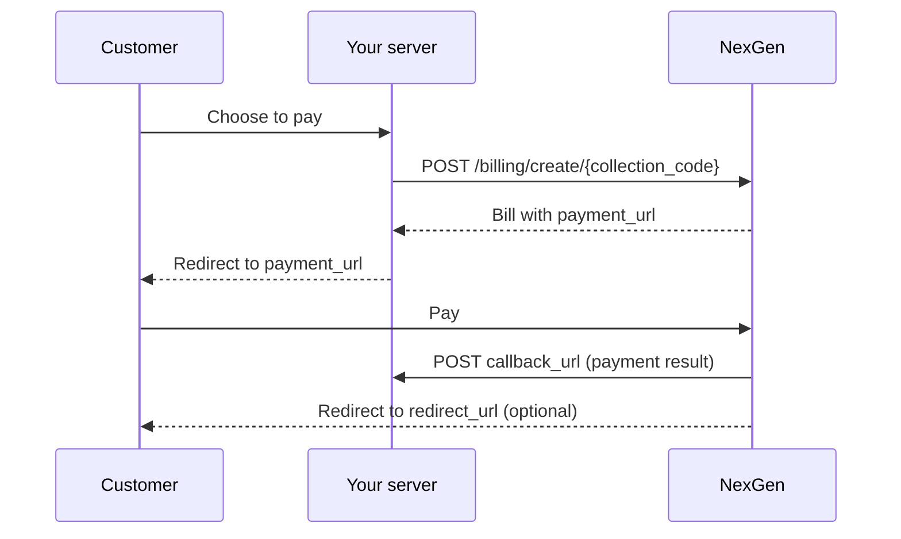

# Collection Payment

A **Collection** groups related bills, such as *Membership Fees*, *Utility Payments* or *Service Charges*. A **Bill** is an invoice for one customer and always belongs to one collection.

## Payment flow

1. Create a collection once, through the API or the NexGen dashboard.
2. When a customer pays, your server creates a bill in that collection.
3. NexGen returns a `payment_url`. Redirect the customer to it.
4. The customer pays with their preferred method.
5. NexGen `POST`s the result to your `callback_url`.
6. If you set a `redirect_url`, NexGen sends the customer back to your site.



See [Callbacks & Redirects](/docs/api/callbacks-and-redirects) for the payloads NexGen sends.

## Collections

### Create a collection

`POST /api/v1/collection/create`

| Field | Required | Description |
| :--- | :--- | :--- |
| `fieldName` | Yes | Collection name |
| `fieldDescription` | Yes | Short description |
| `fieldStatus` | Yes | `active` or `inactive` |

```bash
curl -X POST "https://nexgen.example.com/api/v1/collection/create?ApiSecret=$NEXGEN_API_SECRET" \
  -H "ApiKey: $NEXGEN_API_KEY" \
  -F fieldName="Membership Fees" \
  -F fieldDescription="Annual membership" \
  -F fieldStatus=active
```

Response `201`:

```json
{
  "code": "RLVCQOIA0001",
  "name": "Membership Fees",
  "description": "Annual membership",
  "status": "active"
}
```

Keep the `code`. The other collection and billing endpoints need it as `{collection_code}`.

### Other collection endpoints

| Method | Path | Returns |
| :--- | :--- | :--- |
| `GET` | `/api/v1/collection/get/list` | Array of all your collections |
| `GET` | `/api/v1/collection/get/data/{collection_code}` | One collection |
| `GET` | `/api/v1/collection/get/data/{collection_code}/billing` | One collection, with every bill in `bill_list` |
| `PUT` | `/api/v1/collection/switch/status/data/{collection_code}?fieldStatus=inactive` | The updated collection |

`fieldStatus` on the switch-status endpoint is a **query** parameter and must be `active` or `inactive`.

## Bills

### Create a bill

`POST /api/v1/billing/create/{collection_code}`

| Field | Required | Description |
| :--- | :--- | :--- |
| `fieldName` | Yes | Payer name |
| `fieldEmail` | Yes | Payer email |
| `fieldPhone` | Yes | Payer phone, with country code (e.g. `60123456789`) |
| `fieldAmount` | Yes | Amount as a decimal string (e.g. `10.00`) |
| `fieldPaymentDescription` | Yes | What the payment is for |
| `fieldCallbackUrl` | Yes | Your server endpoint that receives the payment result |
| `fieldRedirectUrl` | No | Where to send the customer after paying |
| `fieldDueDate` | No | When the bill expires |
| `fieldExternalReferenceLabel1` / `fieldExternalReferenceValue1` | No | Your own reference, such as an order ID |

```bash
curl -X POST "https://nexgen.example.com/api/v1/billing/create/RLVCQOIA0001?ApiSecret=$NEXGEN_API_SECRET" \
  -H "ApiKey: $NEXGEN_API_KEY" \
  -F fieldName="Aisyah Rahman" \
  -F fieldEmail="aisyah@example.com" \
  -F fieldPhone=60123456789 \
  -F fieldAmount=10.00 \
  -F fieldPaymentDescription="Membership 2026" \
  -F fieldCallbackUrl="https://example.com/nexgen/callback" \
  -F fieldRedirectUrl="https://example.com/payment/done"
```

Response `201`:

```json
{
  "code": "RLVBEVN241004A9YU1",
  "status": "unpaid",
  "amount": "10.00",
  "payment_description": "Membership 2026",
  "due_date": "05-10-2024 08:49:00",
  "payer_name": "Aisyah Rahman",
  "payer_email": "aisyah@example.com",
  "payer_phone": "60123456789",
  "external_reference_label_1": null,
  "external_reference_value_1": null,
  "redirect_url": "https://example.com/payment/done",
  "callback_url": "https://example.com/nexgen/callback",
  "payment_url": "https://nexgen.example.com/p/b/RLVBEVN241004A9YU1/1"
}
```

Redirect the customer to `payment_url`.

> [!NOTE]
> A missing payment description is reported under the key `fieldDescription` in the `400` error, even though the request field is `fieldPaymentDescription`.

### Get a bill

`GET /api/v1/billing/get/data/{collection_code}/{bill_code}`

This returns the same object as Create Bill. Use it to check a bill's `status` from your server.

## Bill fields

| Field | Description |
| :--- | :--- |
| `code` | Unique bill code |
| `status` | `unpaid`, `pending`, `paid` or `expired` |
| `amount` | Bill amount |
| `payment_description` | What the payment is for |
| `due_date` | Due date, formatted `DD-MM-YYYY HH:mm:ss` |
| `payer_name`, `payer_email`, `payer_phone` | Payer details |
| `external_reference_label_1`…`_4`, `external_reference_value_1`…`_4` | Your own references, `null` when unused |
| `redirect_url` | Where the customer returns after paying, or `null` |
| `callback_url` | Where NexGen sends the payment result |
| `payment_url` | Hosted payment page for the customer |
