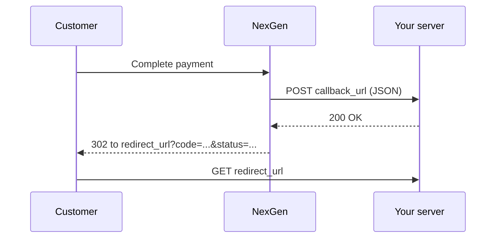

# Callbacks & Redirects

When a payment finishes, NexGen reports the result in two ways:

| | Callback | Redirect |
| :--- | :--- | :--- |
| **Who receives it** | Your server | The customer's browser |
| **How** | `POST` with a JSON body to `callback_url` | `GET` to `redirect_url` with query parameters |
| **Set with** | `fieldCallbackUrl` (required) | `fieldRedirectUrl` (optional, bills only) |
| **Use it to** | Update the order and mark it paid | Show the customer a result page |



## Callback

NexGen sends a `POST` to your `callback_url` with the bill as JSON:

```json
{
  "code": "RLVBXMU241004AXQP6",
  "status": "paid",
  "amount": "10.00",
  "payment_description": "Membership 2026",
  "due_date": "05-10-2024 08:56:00",
  "payer_name": "Aisyah Rahman",
  "payer_email": "aisyah@example.com",
  "payer_phone": "60123456789",
  "external_reference_label_1": null,
  "external_reference_value_1": null,
  "redirect_url": "https://example.com/payment/done",
  "callback_url": "https://example.com/nexgen/callback",
  "payment_url": "https://nexgen.example.com/p/b/RLVBXMU241004AXQP6/1"
}
```

QR payment callbacks contain the QR bill fields instead: `code`, `status`, `amount`, `payment_description`, `due_date`, `external_reference_*_1`/`_2`, `callback_url` and `soundbox_response`.

### Handling the callback

1. Listen for `POST` requests at your `callback_url`.
2. Find the order by `code`, or by your own `external_reference_value_*`.
3. Update the order's status.
4. Return `200 OK` when you're done, or `400 Bad Request` if you couldn't process it.

If processing fails or hasn't finished, the customer stays in a **processing queue**. They aren't redirected until the payment status is confirmed.

> [!WARNING]
> The callback URL must be publicly reachable. It **cannot** be `localhost`. When developing locally, use a tunnel such as `cloudflared tunnel` or a request inspector such as webhook.site.

> [!TIP]
> Before you mark an order paid, confirm the status with [Get a bill](/docs/api/collection-payment#get-a-bill). This protects you from forged callbacks.

Example handler (Hono):

```ts
app.post('/nexgen/callback', async (c) => {
  const payment = await c.req.json()
  if (payment.status === 'paid') {
    await markOrderPaid(payment.code)
  }
  return c.text('OK')
})
```

## Redirect

After a successful callback, NexGen sends the customer to your `redirect_url` with the bill fields as query parameters:

```text
GET /payment/done?code=RLVBXMU241004AXQP6&status=paid&amount=10.00&payment_description=Membership+2026&due_date=2024-10-05T08:56:00&payer_name=Aisyah+Rahman&payer_email=aisyah@example.com&payer_phone=60123456789
```

Read `status` to show "Payment successful" or "Payment failed". Don't fulfil the order from the redirect: anyone can edit a URL. Rely on the callback.

## Payload fields

| Field | Description |
| :--- | :--- |
| `code` | Unique bill code |
| `status` | `unpaid`, `pending`, `paid` or `expired` |
| `amount` | Bill amount |
| `payment_description` | What the payment is for |
| `due_date` | Due date |
| `payer_name`, `payer_email`, `payer_phone` | Payer details (bills only) |
| `external_reference_label_N`, `external_reference_value_N` | Your own references |
| `redirect_url`, `callback_url`, `payment_url` | URLs attached to the bill (bills only) |
| `soundbox_response` | Soundbox audio confirmation (QR only) |
