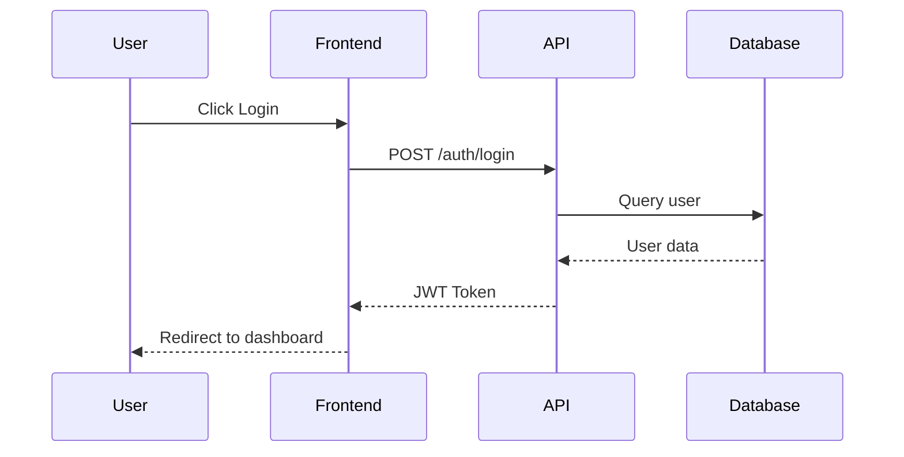
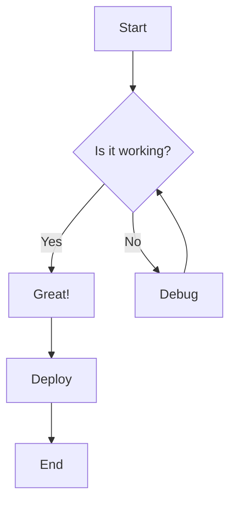
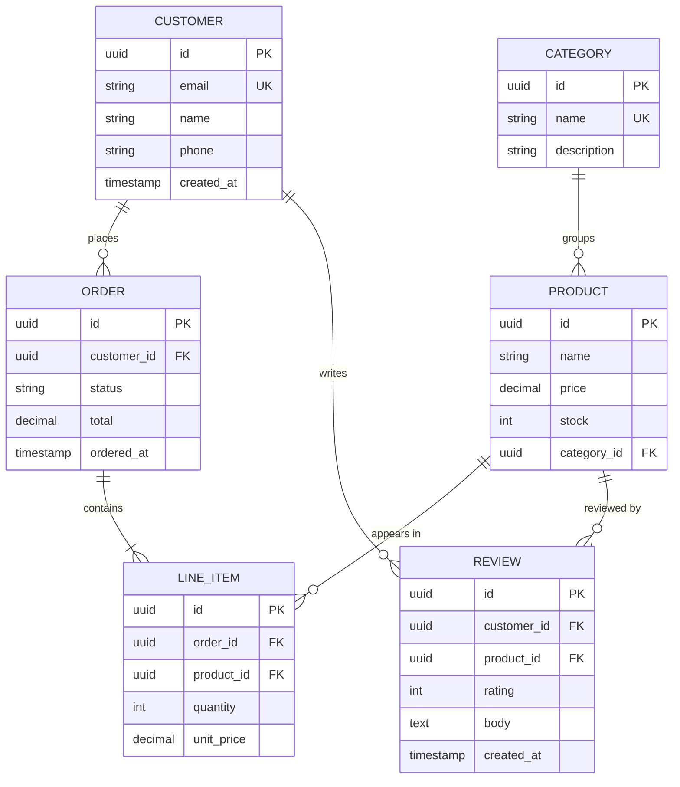
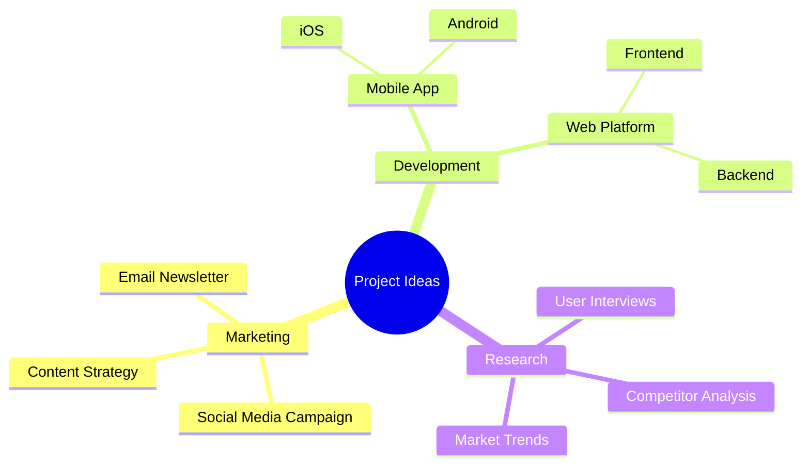

# Mermaid Diagram Example
## Sequence Diagram

```mermaid
sequenceDiagram
    participant User
    participant Frontend
    participant API
    participant Database

    User->>Frontend: Click Login
    Frontend->>API: POST /auth/login
    API->>Database: Query user
    Database-->>API: User data
    API-->>Frontend: JWT Token
    Frontend-->>User: Redirect to dashboard
```
## Flowchart

```mermaid
flowchart TD
    A[Start] --> B{Is it working?}
    B -->|Yes| C[Great!]
    B -->|No| D[Debug]
    D --> B
    C --> E[Deploy]
    E --> F[End]
```
## ER Diagram

```mermaid
erDiagram
    CUSTOMER ||--o{ ORDER : places
    CUSTOMER ||--o{ REVIEW : writes
    ORDER ||--|{ LINE_ITEM : contains
    PRODUCT ||--o{ LINE_ITEM : "appears in"
    PRODUCT ||--o{ REVIEW : "reviewed by"
    CATEGORY ||--o{ PRODUCT : groups

    CUSTOMER {
        uuid id PK
        string email UK
        string name
        string phone
        timestamp created_at
    }
    ORDER {
        uuid id PK
        uuid customer_id FK
        string status
        decimal total
        timestamp ordered_at
    }
    LINE_ITEM {
        uuid id PK
        uuid order_id FK
        uuid product_id FK
        int quantity
        decimal unit_price
    }
    PRODUCT {
        uuid id PK
        string name
        decimal price
        int stock
        uuid category_id FK
    }
    CATEGORY {
        uuid id PK
        string name UK
        string description
    }
    REVIEW {
        uuid id PK
        uuid customer_id FK
        uuid product_id FK
        int rating
        text body
        timestamp created_at
    }
```
## Mind Map

```mermaid
mindmap
  root((Project Ideas))
    Marketing
      Social Media Campaign
      Email Newsletter
      Content Strategy
    Development
      Mobile App
        iOS
        Android
      Web Platform
        Frontend
        Backend
    Research
      User Interviews
      Competitor Analysis
      Market Trends
```